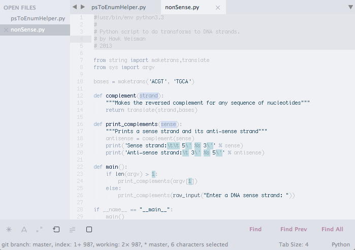

Orbit
=====

Color schemes for SublimeText, intended for use with kkga's [Spacegray](https://github.com/kkga/spacegray). May also contain custom theme files later.

Features
--------

+ Harmonious palettes designed using color theory.
+ "Focused-based" syntax coloring --- designed to make the most important code elements visually immediate.
+ Highlighting for invalid and deprecated syntax
+ Highlighting for diffs.
+ Support for semi-WYSIWYG (what you see is sort of what you get?) markup in LaTeX, Markdown, and [X]HTML.
+ Support for the great [MarkdownEditing](https://github.com/SublimeText-Markdown/MarkdownEditing) package.

Screenshots
-----------

### Prograde:
Editing Java:

Editing Python:

Editing Markdown (with MarkdownEditing installed):


Font is Monaco 10 with anti-aliasing disabled.

Using the custom MarkdownEditing scheme
---------------------------------------

Using the custom scheme for MarkdownEditing is very easy - just add the following to the MarkdownEditing user settings files for Github-Flavored Markdown, MultiMarkdown, and standard Markdown:
```json
{
    "color_scheme": "Packages/Orbit Color Scheme/Orbit.prograde.tmTheme",
}
```
